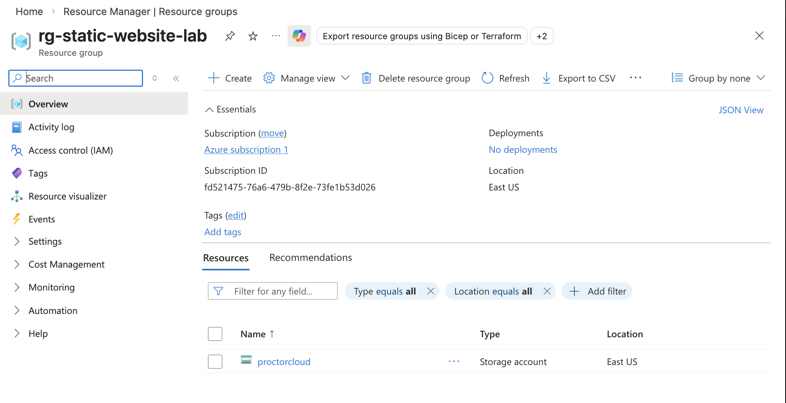
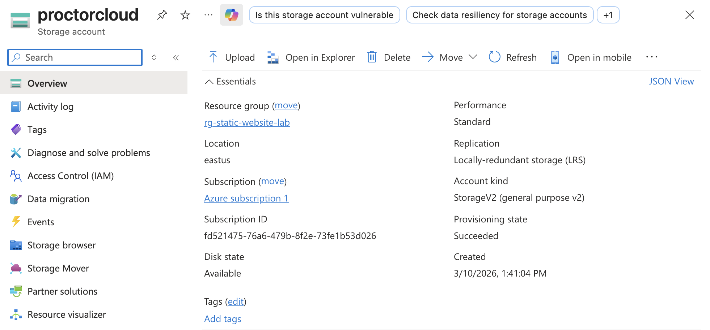
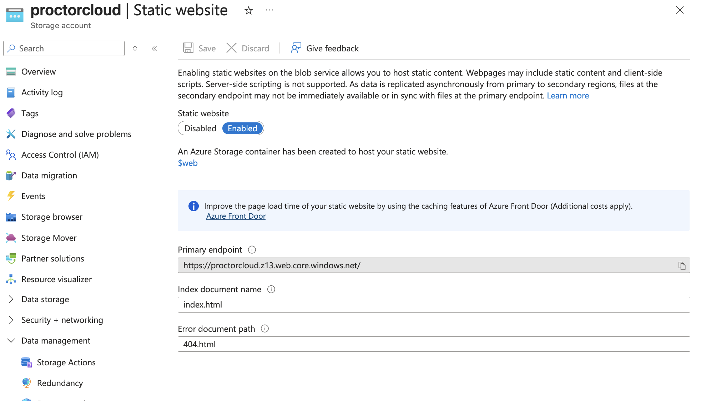
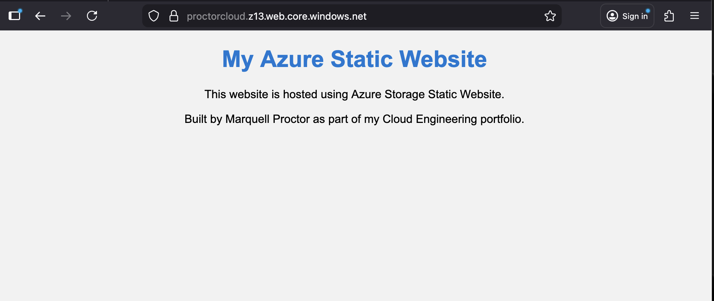

# Azure Static Website Hosting Project

This project demonstrates how to deploy a publicly accessible static website using **Azure Storage Static Website hosting**. The deployment showcases foundational cloud engineering concepts including **object storage, resource organization, and cloud-based web hosting**.

The website is hosted directly from **Azure Blob Storage** without requiring traditional web servers.


---

# Live Website

https://proctorcloud.z13.web.core.windows.net/

---

# Architecture Overview

```
User
 │
 │
Azure Storage Static Website
 │
 │
$web container
 │
 ├── index.html
 └── styles.css
```

This architecture demonstrates how static website assets can be served directly from **Azure object storage**.

---

# Azure Services Used

- Azure Resource Groups
- Azure Storage Account
- Azure Blob Storage
- Azure Static Website Hosting

---

# Project Structure

```
azure-static-website-hosting

README.md

website/
   index.html
   styles.css

screenshots/
   resource-group.png
   storage-account.png
   static-website-enabled.png
   website-live.png
```

---

# Deployment Walkthrough

## 1. Create Resource Group

A dedicated **Azure Resource Group** was created to logically organize all cloud resources used in the project.



---

## 2. Deploy Azure Storage Account

An **Azure Storage Account** was deployed to host the static website files using **Blob Storage**.



---

## 3. Enable Static Website Hosting

Static Website hosting was enabled within the Storage Account.  
This automatically created the **$web container**, which stores the website files.



---

## 4. Upload Website Files

The website files were uploaded to the **$web container**.

```
index.html
styles.css
```

---

## 5. Validate Live Deployment

The static website was successfully deployed and made publicly accessible through the Azure storage endpoint.



---

# Key Cloud Concepts Demonstrated

- Object storage for web hosting
- Static website deployment without traditional servers
- Cloud resource organization with Resource Groups
- Blob container architecture
- Cloud application deployment workflow

---

# Skills Demonstrated

Azure, Cloud Architecture, Azure Storage, Blob Storage, Static Website Hosting, Resource Groups, HTML, CSS

---

# Future Improvements

Possible enhancements to this project include:

- Configure **Azure CDN for global caching**
- Add **custom domain name**
- Deploy infrastructure using **Terraform**
- Implement **monitoring and logging**

---

# Author

**Marquell Proctor**

Cloud Engineering Portfolio Project
